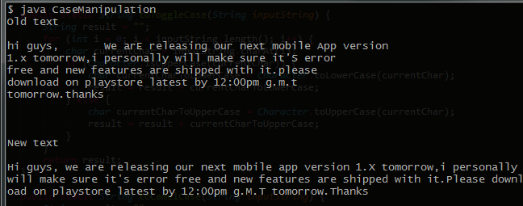

# CoreSent.java

[](https://travis-ci.org/abdulapopoola/Stream) [](https://david-dm.org/abdulapopoola/Stream.svg) [](https://david-dm.org/abdulapopoola/Stream#info=devDependencies) 
========================

What do you think about this sentence?

```text
//Old text
String message = "hi guys,       We arE releasing our next mobile App version\n" +
                    "1.x tomorrow,i personally will make sure it'S error;\n" +
                    "free and new features are shipped with it.please\n" +
                    "download on playstore latest by 12:00pm g.m.t \n" +
                    "tomorrow.thanks\n";
```
Full of grammar and syntax error ?


```Java
String output = StreamText.(message)
                          .checkFullStop('.')
                          .checkThis('!',',','?','/')
                          .toCapitalLetter();
                          .checkComma(',')
                          .checkThis(':',',','|','-')
                          .toSmallLetter()
                          .toCoreSent();

// or

String output_1 = StreamText.(message)
                          .checkAllSyntax()
                          .toCoreSent();


System.out.println(output);
```

Beautifully succinct right?


```text
//New text
Hi guys, we are releasing our next mobile app version 1.X tomorrow,i personally will 
make sure it's error; Free and new features are shipped with it.Please download on 
playstore latest by 12:00pm g.M.T tomorrow.Thanks
```



# Getting started


> What is CoreSent.java ?

CorSen is an abbrivation for Correct Sentences, it's a newly created api in Java language that enhance better sentences for web/mobile apps users.

# What problem is CoreSent solving ?

CoreSent is currently solving a single problem, to rewrite incorrect sentences with punctuation signs followed with inappropiate case.
> Example : A user type the following on Facebook

- [hi guys, We arE releasing our next mobile App version 1.x tomorrow,i personally will make sure it'S error
free and new features are shipped with it.please download on playstore latest by 12:00pm g.m.t  tomorrow.thanks] (#text)


> CoreSent approach : This text above have some errors which can be auto fix by the api

- [Errors : Note ErrSens means error sentence ]

 - 1.  ErrSens :hi guys
       CoreSens : Hi guys
     > A sentence must start with capital letter

- 2. ErrSens : We arE .. mobile App..
   > CorSesns : we are... mobile app

----------------------Capital letter must not start or end with a word  before comma ","  in any condition, except for abbrevation and it must all be in capital letter.---------------------

 -- The word app is an short hand form of  writing "applications" which must all be in lower case i.e  except for personal pronouns like "I, ..."  can only be in capital letter in any sentence


-  3.  ErrSens: ...tomorrow,i personally 
    CorSens: ...tomorrow, I personally

Any word followed with any punctuation must be followed by a white
space, along with thier rules
  <br>
  i. All personal pronouns(I,...) must be in Capital letter
when used
  ii. All words or latter followed by comma ","must be in small letter
  iii. All words or latter followed by fullstop "."must be in capital letter
  iv. All words or latter followed by apostrophe "!"must be in capital letter
  v. All words or latter followed by comma "," must be in small letter
  vi. All words or latter followed by question mark "?" must be in small letter
  </br>
- 4. ErrSens: with it.please
   CorSens: with it. Please

|| Using rule 3(iii)

- 5.  ErrSens: 12:00pm g.m.t 
    CorSens: 12:00PM G.M.T
g.m.t is an abrrevation which all words must be in capital letter
"G.M.T"


- 6.  ErrSens: tomorrow.thanks
    CorSens: tomorrow. Thanks


## What is the limitation of your API ?

<br>There are many limitations</br> 

- 1. Correcting newly created word,

Example : word "CorSens", the api will see this as error,  and will be written as "Corsens" or "corsens" as all english
text have their rules as stated above

- 2. Correcting mispelled words

Situation where user type areE, the api correct it to "aree", which is not an existing word in english. We just started CorSens API, and we hope to improve daily .


## So, your api "CorSens" can only rewrite or correct word with inappropiate
punctuation signs ?

> Yes.

## Will both users need such ?

>> Some will definetly use , while some may not .

## So, what is the need for this ?

>> Our focus is to have single well written and open source api that will provide well written and syntax error free sentence for users on any platofrm ( web & mobile ). We just started, currently our api solves the following

 > 1.Sentence or words with inappropiate lower or upper case as stated in 3


## Technically speaking, what is your approach for this api ?

> Our API, currently solves the above stated problem in a similar manner to
how humans correct or rewrite sentence "read and correct one after the other".
 Uisng advance stream looping to walk though the sentences one by one
, rewriting and assigning it to a the same variable.


# Is that all ?

> Yes, that is currently what we have achieved, more algorith coming to CorSens

# How can I use your api in my Java program ?


```Java
              Maven users, add to your depencency
<br/>
    <dependency>
        <groupId>com.futureisnow.text.corsens</groupId>
        <artifactId>CorSens</artifactId>
        <version>0.1</version>
    </dependency>
<br/>

TestCoreSent.java

import com.futureisnow.text.corsens.StreamText;
public class App{
      private static String message = "hi guys, We arE releasing our next mobile App version
                                        1.x tomorrow,i personally will make sure it'S error
                                          free and new features are shipped with it.please
                                            download on playstore latest by 12:00pm g.m.t 
                                              tomorrow.thanks";

      public static void main (String[]args){
     
            String output = StreamText.(message)
                                      .checkFullStop('.')
                                      .checkThis('!',',','?','/')
                                      .toCapitalLetter();
                                      .checkComma(',')
                                      .checkThis(':',',','|','-')
                                      .toSmallLetter()
                                      .toCoreSent();

// or

          String output_1 = StreamText.(message)
                                .checkAllSyntax()
                                .toCoreSent();

          System.out.println(output);
      }

}
```

-Do you still want to asnwer more question ?

<b>No</b>

# [Documentation](https://github.com/badmusamuda/CoreSent/blob/master/api/documentation.md)

The stream-js API is available [here](https://github.com/badmusamuda/CoreSent/blob/master/api/documentation.md)

# Contributing

Got ideas to improve CoreSent.java? Or found a bug? Please file a new [issue] (https://github.com/badmusamuda/CoreSent/issues/new). 


# Copyright and license

Created and copyright (c) 2015 by Amuda Adeolu Badmus.

CoreSent.java is licensed under the [Apache license](https://github.com/badmusamuda/CoreSent/blob/master/LICENSE).

